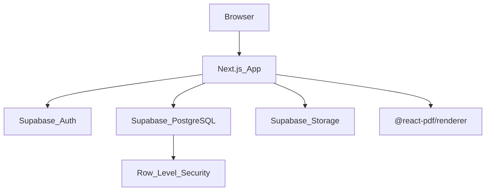

# Invoice Generator by Strynder — Technical Specification

**Status:** Pre-implementation — planned architecture aligned to [PRD.md](PRD.md) and [DECISIONS.md](DECISIONS.md).

---

## 1. System overview

| Item | Value |
|------|-------|
| Product | Invoice Generator by Strynder v1.0 |
| Type | Full-stack responsive web application |
| Framework | Next.js 15 (App Router) |
| Language | TypeScript |
| UI | React 19, Tailwind CSS 4 |
| Database | Supabase PostgreSQL |
| Auth | Supabase Auth |
| File storage | Supabase Storage |
| PDF export | `@react-pdf/renderer` (client-side) |
| Hosting | Vercel + Supabase |

---

## 2. Architecture



**Request flow (authenticated page):**

1. Browser requests protected route (`/dashboard`, `/profile`, `/invoices/*`)
2. Next.js middleware refreshes Supabase session from cookies (`@supabase/ssr`)
3. Server Component queries data via Supabase server client
4. Mutations use Server Actions with authenticated Supabase client
5. RLS enforces `auth.uid() = user_id` on all tables

**Invoice PDF flow:**

1. User builds invoice in `InvoiceForm` with live `InvoicePreview`
2. On save, Server Action inserts invoice + line items into Supabase PostgreSQL
3. On invoice detail page, `DownloadPdfButton` renders `InvoicePdfDocument` to blob
4. Browser downloads `{invoiceNumber}_{clientName}.pdf`

---

## 3. Planned project structure

```
src/
├── app/
│   ├── (auth)/
│   │   ├── login/page.tsx
│   │   ├── register/page.tsx
│   │   ├── forgot-password/page.tsx
│   │   └── reset-password/page.tsx
│   ├── (app)/
│   │   ├── layout.tsx
│   │   ├── dashboard/page.tsx
│   │   ├── profile/page.tsx
│   │   ├── payment-details/page.tsx
│   │   └── invoices/
│   │       ├── page.tsx
│   │       ├── new/page.tsx
│   │       └── [id]/page.tsx
│   ├── layout.tsx
│   ├── page.tsx
│   └── globals.css
├── actions/
│   ├── auth.ts
│   ├── profile.ts
│   ├── payment.ts
│   └── invoices.ts
├── components/
│   ├── AppNav.tsx
│   ├── AuthForm.tsx
│   ├── ProfileForm.tsx
│   ├── PaymentForm.tsx
│   ├── InvoiceForm.tsx
│   ├── InvoicePreview.tsx
│   ├── InvoicePdfDocument.tsx
│   ├── DownloadPdfButton.tsx
│   └── InvoiceActions.tsx
├── lib/
│   ├── supabase/
│   │   ├── client.ts       # Browser client
│   │   ├── server.ts       # Server client (cookies)
│   │   └── middleware.ts   # Session refresh
│   ├── calculations.ts
│   ├── format.ts
│   ├── constants.ts
│   ├── payment.ts
│   └── profile-completion.ts
└── middleware.ts
supabase/
└── migrations/               # SQL migrations for schema + RLS
```

---

## 4. Supabase database schema

All application tables live in the `public` schema. Every table includes `user_id uuid NOT NULL REFERENCES auth.users(id) ON DELETE CASCADE`.

### business_profiles

| Column | Type | Notes |
|--------|------|-------|
| id | uuid (PK) | `gen_random_uuid()` |
| user_id | uuid (unique) | FK → auth.users |
| owner_name | text | Optional |
| business_name | text | Optional |
| logo_url | text | Supabase Storage public URL |
| address | text | Optional |
| phone | text | Optional |
| email | text | Optional |
| slogan | text | Optional |
| default_currency | text | Default `NGN` |
| default_header_color | text | Default `#1e3a5f` |
| created_at | timestamptz | `now()` |
| updated_at | timestamptz | `now()` |

### payment_details

| Column | Type | Notes |
|--------|------|-------|
| id | uuid (PK) | |
| user_id | uuid (unique) | FK → auth.users |
| bank_name | text | Optional |
| account_name | text | Optional |
| account_number | text | Optional |
| additional_note | text | Optional |
| created_at | timestamptz | |
| updated_at | timestamptz | |

### invoices

| Column | Type | Notes |
|--------|------|-------|
| id | uuid (PK) | |
| user_id | uuid | FK → auth.users |
| invoice_number | text | e.g. INV-20260609-142 |
| issue_date | date | Required |
| due_date | date | Optional |
| currency | text | `NGN`, `USD`, or `GBP` |
| client_name | text | Required |
| client_address | text | Optional |
| client_email | text | Optional |
| client_phone | text | Optional |
| vat_enabled | boolean | Default false |
| vat_rate | numeric | Default 7.5 |
| subtotal | numeric | Computed on save |
| vat_amount | numeric | Computed on save |
| grand_total | numeric | Computed on save |
| header_color | text | Hex from palette |
| profile_snapshot | jsonb | Frozen business profile at save time |
| payment_details | text | Formatted payment text snapshot |
| notes | text | Optional footer |
| status | text | `draft` or `finalized` |
| created_at | timestamptz | |

### line_items

| Column | Type | Notes |
|--------|------|-------|
| id | uuid (PK) | |
| invoice_id | uuid | FK → invoices, cascade delete |
| sort_order | int | 1-based |
| description | text | Required |
| quantity | numeric | Min 1 |
| unit_price | numeric | In invoice currency |
| line_total | numeric | `quantity × unit_price` |

**Snapshot strategy:** `profile_snapshot` (jsonb) and `payment_details` (text) on `invoices` freeze data at creation. Per-invoice edits do not update `business_profiles` or `payment_details`.

---

## 5. Row Level Security (RLS)

Enable RLS on all four tables. Example policies:

```sql
ALTER TABLE business_profiles ENABLE ROW LEVEL SECURITY;
ALTER TABLE payment_details ENABLE ROW LEVEL SECURITY;
ALTER TABLE invoices ENABLE ROW LEVEL SECURITY;
ALTER TABLE line_items ENABLE ROW LEVEL SECURITY;

CREATE POLICY "Users manage own profile" ON business_profiles
  FOR ALL USING (auth.uid() = user_id);

CREATE POLICY "Users manage own payment details" ON payment_details
  FOR ALL USING (auth.uid() = user_id);

CREATE POLICY "Users manage own invoices" ON invoices
  FOR ALL USING (auth.uid() = user_id);

CREATE POLICY "Users manage own line items" ON line_items
  FOR ALL USING (
    auth.uid() = (SELECT user_id FROM invoices WHERE id = invoice_id)
  );
```

---

## 6. Supabase Auth

| Flow | Implementation |
|------|----------------|
| Register | `supabase.auth.signUp({ email, password })` |
| Login | `supabase.auth.signInWithPassword({ email, password })` |
| Logout | `supabase.auth.signOut()` |
| Password reset | `supabase.auth.resetPasswordForEmail(email)` |
| Session | `@supabase/ssr` cookie-based session in Next.js middleware |

On registration, create empty `business_profiles` and `payment_details` rows for the new `auth.users.id` (via database trigger or Server Action).

---

## 7. Supabase Storage

| Setting | Value |
|---------|-------|
| Bucket name | `logos` |
| Path pattern | `{user_id}/logo.{ext}` |
| Max size | 2 MB |
| Allowed types | PNG, JPG, WebP |
| Access | Authenticated upload; public read or signed URLs for PDF rendering |

Storage policy: users can upload/update/delete only within their own `{user_id}/` folder.

---

## 8. Server actions (planned)

### auth.ts

| Action | Purpose |
|--------|---------|
| registerAction | Supabase signUp + create profile/payment rows |
| loginAction | Supabase signInWithPassword |
| logoutAction | Supabase signOut |
| forgotPasswordAction | resetPasswordForEmail |
| resetPasswordAction | updateUser password |

### profile.ts

| Action | Purpose |
|--------|---------|
| updateProfileAction | Upsert `business_profiles`; upload logo to Storage |

### payment.ts

| Action | Purpose |
|--------|---------|
| updatePaymentAction | Upsert `payment_details` |

### invoices.ts

| Action | Purpose |
|--------|---------|
| createInvoiceAction | Insert invoice + line_items with computed totals |
| deleteInvoiceAction | Delete invoice (cascades line_items) |
| duplicateInvoiceAction | Copy invoice as new draft |

---

## 9. Core business logic

### Calculations

```
lineTotal  = round(quantity × unitPrice, 2)
subtotal   = sum(lineTotal)
vatAmount  = vatEnabled ? round(subtotal × vatRate / 100, 2) : 0
grandTotal = round(subtotal + vatAmount, 2)
```

Default VAT rate: **7.5%**.

### Currency formatting

| Currency | Format |
|----------|--------|
| NGN | `₦` + en-NG locale, 2 decimals |
| USD | `Intl.NumberFormat("en-US", { style: "currency", currency: "USD" })` |
| GBP | `Intl.NumberFormat("en-GB", { style: "currency", currency: "GBP" })` |

### Invoice numbering

Format: `INV-{YYYYMMDD}-{100-999 random}`

### Header colors (8 presets)

Navy `#1e3a5f`, Teal `#0f766e`, Emerald `#047857`, Burgundy `#6d213c`, Charcoal `#2d3436`, Royal Blue `#1d4ed8`, Gold Accent `#b45309`, Black `#111827`

---

## 10. Routing

| Route | Access | Purpose |
|-------|--------|---------|
| `/` | Public | Landing |
| `/login`, `/register` | Public | Auth |
| `/forgot-password`, `/reset-password` | Public | Password reset |
| `/dashboard` | Auth | Home |
| `/profile` | Auth | Business profile |
| `/payment-details` | Auth | Bank/payment fields |
| `/invoices` | Auth | Invoice list |
| `/invoices/new` | Auth | Create invoice |
| `/invoices/:id` | Auth | View + download PDF |

---

## 11. Environment variables

```env
NEXT_PUBLIC_SUPABASE_URL=
NEXT_PUBLIC_SUPABASE_ANON_KEY=
SUPABASE_SERVICE_ROLE_KEY=    # server-only; never expose to client
NEXT_PUBLIC_APP_URL=http://localhost:3000
```

| Variable | Required | Purpose |
|----------|----------|---------|
| NEXT_PUBLIC_SUPABASE_URL | Yes | Supabase project URL |
| NEXT_PUBLIC_SUPABASE_ANON_KEY | Yes | Public anon key (RLS-protected) |
| SUPABASE_SERVICE_ROLE_KEY | Yes (server) | Admin operations only |
| NEXT_PUBLIC_APP_URL | Yes | Password reset redirect base |

---

## 12. Key dependencies (planned)

```json
{
  "next": "^15.x",
  "react": "^19.x",
  "typescript": "^5.x",
  "tailwindcss": "^4.x",
  "@supabase/supabase-js": "^2.x",
  "@supabase/ssr": "^0.x",
  "@react-pdf/renderer": "^4.x"
}
```

No Prisma. No SQLite. Data access exclusively via Supabase JS client.

---

## 13. Deployment

| Component | Platform |
|-----------|----------|
| Web app | Vercel |
| Database | Supabase PostgreSQL (managed) |
| Auth | Supabase Auth |
| Logos | Supabase Storage |
| Env vars | Vercel project settings + Supabase dashboard |

Supabase region should be chosen with NDPR/data residency requirements in mind.

---

## 14. Security

| Control | Implementation |
|---------|----------------|
| Authentication | Supabase Auth (bcrypt, secure sessions) |
| Authorization | RLS on all tables |
| Data isolation | `auth.uid() = user_id` policies |
| Logo uploads | Type/size validation + Storage policies |
| Service role key | Server-only; never in client bundle |
| HTTPS | Enforced in production |

---

## 15. Performance targets

| Metric | Target |
|--------|--------|
| Invoice preview load | < 2s |
| PDF generation | < 5s |
| Supabase query | < 500ms |
| First Contentful Paint | < 1.5s |

---

## 16. Documentation artifacts

| File | Purpose |
|------|---------|
| PRD.md / PRD.pdf | Product requirements |
| TECH-SPEC.md / TECH-SPEC.pdf | This technical specification |
| DECISIONS.md | Resolved architecture decisions |

Regenerate PDFs:

```bash
python3 scripts/generate_docs_pdf.py
```
